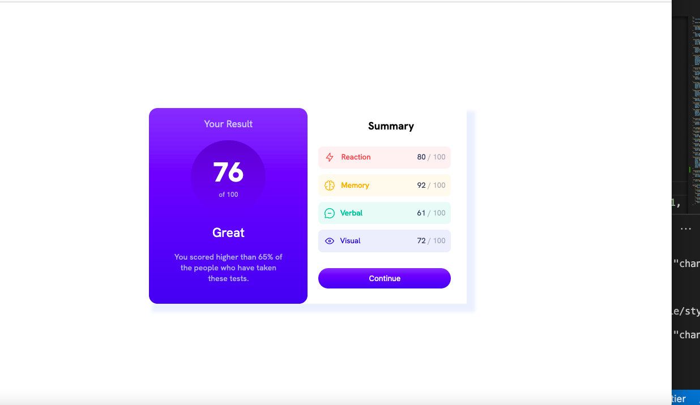

# Frontend Mentor - Results summary component solution

This is a solution to the [Results summary component challenge on Frontend Mentor](https://www.frontendmentor.io/challenges/results-summary-component-CE_K6s0maV). Frontend Mentor challenges help you improve your coding skills by building realistic projects.

## Table of contents

- [Overview](#overview)
  - [The challenge](#the-challenge)
  - [Screenshot](#screenshot)
  - [Links](#links)
- [My process](#my-process)
  - [Built with](#built-with)
  - [What I learned](#what-i-learned)
  - [Continued development](#continued-development)
  - [Useful resources](#useful-resources)

## Overview

### The challenge

Users should be able to:

- View the optimal layout for the interface depending on their device's screen size
- See hover and focus states for all interactive elements on the page

### Screenshot

### Links

- Solution URL: [https://github.com/chanchala-amar/results-summary-component]
- Live Site URL: [https://chanchala-amar.github.io/results-summary-component/]

## My process

### Built with

- Semantic HTML5 markup
- CSS custom properties
- Flexbox
- Mobile-first workflow

### What I learned

Built using only flexbox. I found CSS grid easier to use for positioning of elements on the page.

Learnt a lot about aligning, positioning, relative ratios and justifying flex items.

### Continued development

CSS only circles that are responsive.
Limit the width of a flex element in a page when it is the only element.
Use Vue to read data from json and populate the html page

### Useful resources

- [MDN docs](https://developer.mozilla.org/en-US/docs/Web/CSS/CSS_Flexible_Box_Layout/Aligning_Items_in_a_Flex_Container) - This helped me learn all about aligning flex items.
- [CSS circles that expand according to content](https://jsfiddle.net/36m7796q/2/) - Beautiful CSS circles .
